# Makina Attack Analyze 攻击分析

> 声明：这是本人第一次分析攻击事件，可能过于仔细和繁琐，但绝对准确，转载请注明出处 @anon-cBE4

## 新闻报道

Makina Finance在2026年1月20日遭受攻击，导致413万美元的严重损失。此次攻击针对其DUSD/USDC Curve池，根源在于价格反馈操纵漏洞。尽管有MEV机器人拦截了部分资金以防止完全损失，但此事件突显了DeFi协议的治理和安全风险。

## 简要分析（不涉及技术，按需跳过）

### 各方的资金变动

攻击符合经典的通过闪电贷操纵价格预言机的标准流程：借款——操纵预言机——获利——还款。

整个交易除了攻击本身外，还有单次攻击不足以掏空池子因此进行了两次攻击，贿赂矿工提高优先级。

交易Tx：https://app.blocksec.com/phalcon/explorer/tx/eth/0x569733b8016ef9418f0b6bde8c14224d9e759e79301499908ecbcd956a0651f5?showStaticCall=true

攻击本身导致 DUSDUSDC 池子中的 USDC 被全部抽走，损失 `- $5,107,871.18`

收益绝大部分被转入 MEV Builder（0xa6c248384C5DDd934B83D0926D2E2A1dDF008387），共 `+ $4,151,959.74`

收益中一小部分被转入 Makinafi Exploiter（0x935bfb495E33f74d2E9735DF1DA66acE442ede48） ，实际上是抢跑了本次交易的 MEV Bot ，共 `+ $415.76`。

> 备注：严谨来说，交易并非被 **抢跑**，而是被 **偷了Exp**，MEV Bot 通过某种渠道把 Exp 抄走并且执行，详见技术分析。

其余资金均为利息、滑点损失等交易磨损，收益到了各个池子。

因为攻击是被 MEV Bot 抢跑的，所以**黑客的收益是 0**！！！

MEV Builder 根据 `SEAL Whitehat Safe Harbor`，承诺归还 90% 的收益。

**因此总体损失大约是 `$ 1,000,000`，对于大型项目来说，亏损不算特别严重。**

为什么 Bot 愿意放弃 99% 的利润？

<details>
<summary>Gemini：因为如果不放弃，它就拿不到这笔交易。</summary>

网络上出现了一个巨大的套利机会或漏洞利用（Exploit），利润假设为 100 ETH。

这个机会是公开可见的（在 Mempool 中），或者被通用抢跑机器人（Generalized Frontrunners）侦测到了。

Bot A 发现了，构造了一个交易包（Bundle），为了确保被打包，它出价贿赂 50 ETH。

Bot B 也发现了，它为了抢过 A，出价 60 ETH。

Bot C 是个狠人，它出价 99 ETH。

结果：Builder（区块构建者）只会选择出价最高的那个包。Bot C 赢了，虽然它只赚了 1 ETH，但由于这是无风险套利，赚 1 ETH 总比赚 0 好。

通用抢跑机器人的泛滥 (Generalized Frontrunning)

以前，你需要写很复杂的代码才能发现漏洞。现在，有很多“通用抢跑机器人”。

原理：它们不理解你的业务逻辑，它们只是模拟你的交易。如果发现你赚钱了，它们就复制你的 Payload，把受益人地址改成自己，然后以更高的 Gas/贿赂费重发。

后果：哪怕是你辛苦发现的独家漏洞，一旦广播到公网 Mempool，立刻会被这些无脑机器人抢走。为了对抗它们，你必须把贿赂费拉满到 99% 甚至 99.9%，让抢跑者觉得“无利可图”而放弃。

</details>

因此，该交易的发起者并非是黑客，出于习惯，将地址标记为了 `Makinafi Exploiter`，而且被 etherscan 标狼打。。。

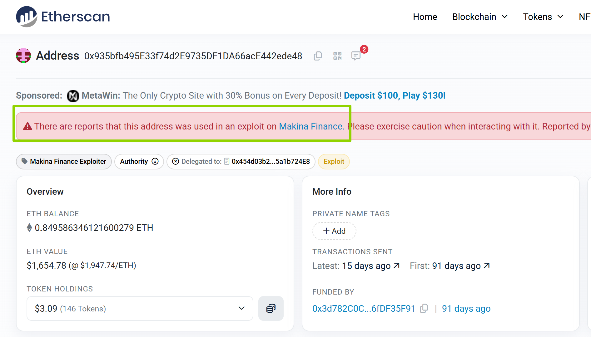

## 技术分析

### Step0：黑客是谁？黑客的Exp是怎样被偷的？

> 本来分析文章已经写完了，这个是后来补充的

该攻击使用了 EIP-7702 技术，在运行期间将 EOA 委托给了 0x454d03b2a1D52F5F7AabA8E352225335a1b724E8 合约，该合约是一个类似轻量级的解释器，本身不含有Exploit。而且Exploiter里包含 Bot 的硬编码的地址，进一步印证了它是专属该Bot的合约。

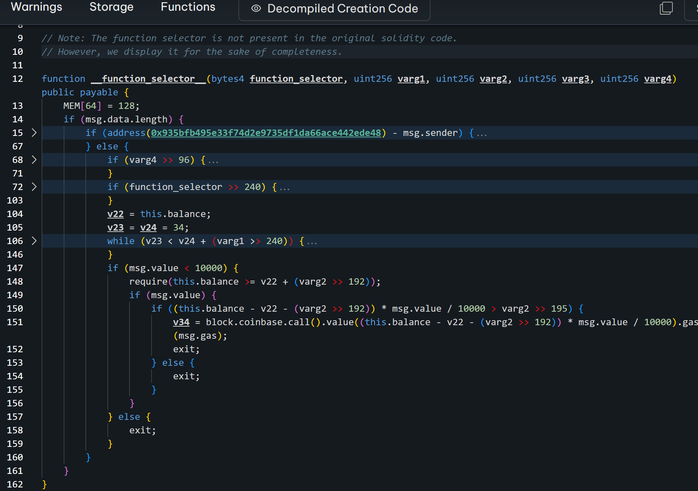

它在 0xc7be20afda6131c077c64876dcb9a4ed7aca3f0e89332fdbc83c2486c373f969 （Nov-12-2025 01:25:11 AM UTC）被创建，远远早于攻击的发生，所以 MEV Bot 肯定不是黑客，这时候线索断了。

在 tkmk 大佬的指点下，Bot 肯定是抄的其他人的作业，建议观测 block 附近的合约创建情况，Gemini 给我干好了，恰好只有2个创建合约。

> Prompt：现在任务是web3链上侦探，告诉我eth主网的 24273360 ~ 24273362 block 创建了哪几个合约，tx 和 address 是什么
> 24273361 0xc17bb57ab32b285b1edd43acbc52c816b65dc6ca9776938bd0fcf729b71de012 0xb7061aa5b7038c805291191bd62e9ab6a2226944
> 24273361 0xad945d38ec5dc00f0310b6f22d19da3b8b5063b9f3e7efb38ca6a5cbc6385a39 0x2c19b916b29e5170f75628d690623dedcafeca4c

第一个合约是 ERC20，第二个合约的code里恰好有攻击相关的常量地址。在线反编译的结果是 https://etherscan.io/address/0x2c19b916b29e5170f75628d690623dedcafeca4c ，看起来确实是 exp。

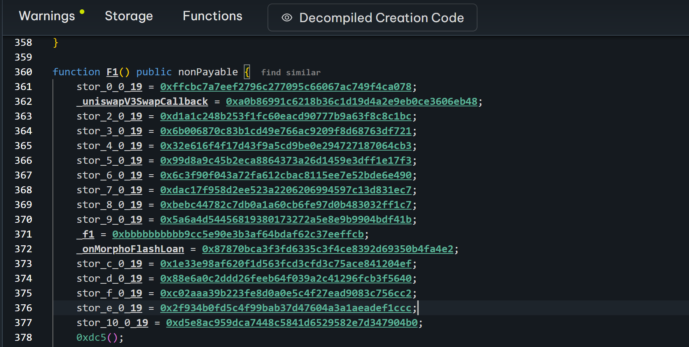

那么，黑客就是 0x2f934b0fd5c4f99bab37d47604a3a1aeadef1ccc ，而它的 ETH 来源是 0x27Bbb53d632ab883343E1b4CDa1B3b3599b494Ce，上游是 `Tornado.Cash: 0.1 ETH` ，那就是纯黑客了。

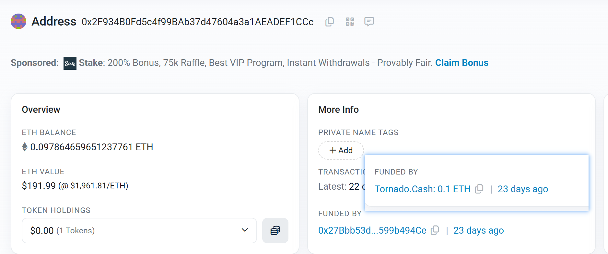

然后，黑客部署合约后，没来得及调用就被 MEV Bot 把 Exp偷走了（个人感觉这个技术非常牛逼），令人忍俊不禁，黑客的手法还需要改进。

### Step0.5：黑客其实是有防御的，但MevBot太厉害了

> 本来Step0 已经写完了，这个是后来补充的

上文我们说，黑客把Exp发布到了链上，但其实Exp在调用过程中，会有一个检查。

```solidity
    v24, /* bool */ v25 = 0xd5e8ac959dca7448c5841d6529582e7d347904b0.V().gas(msg.gas);
    require(bool(v24), 0, RETURNDATASIZE()); // checks call status, propagates error data on error
    require(MEM[64] + RETURNDATASIZE() - MEM[64] >= 32);
    require(v25 == bool(v25));
```

注意 0xd5e8ac959dca7448c5841d6529582e7d347904b0.V()，它是黑客发布的另一个合约，反汇编如下

```solidity
function V() public payable {  find similar
    if (address(tx.origin) == address(0x2f934b0fd5c4f99bab37d47604a3a1aeadef1ccc)) {
        v0 = v1 = 0;
    } else {
        v0 = v2 = 1;
    }
    return bool(v0);
}
```

也就是说，正常人调用黑客的合约是无法完成攻击的，只有黑客自己可以完成该攻击。

**即便如此，也被MevBot偷了，MevBot真是太厉害了。。。**

### Step1：贷款2.8亿， 花 1.1 亿攻击 DUSDUSDC 池，拉高 DUSD 价格

调用 `Morpho: Morpho Blue` （0xbbbbbbbbbb9cc5e90e3b3af64bdaf62c37eeffcb）借款，金额是它全部的 USDC，共 160590920.349812，由 `onMorphoFlashLoan` 回调。

在 `onMorphoFlashLoan` 回调中，调用 `Aave: Pool V3`（0x87870Bca3F3fD6335C3F4ce8392D69350B4fA4E2）借款，金额是 119409079.650188，总和是 2.8亿 USDC。

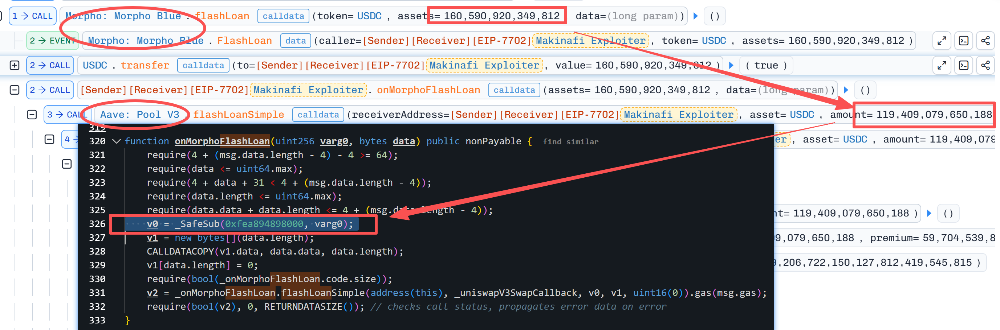

先花 1亿 进行 add_liquidity， 再花 1千万 exchange，此时获得了 LP 和 DUSD，目的是进一步抬高 DUSD 的价格，是操纵汇率的常用手段。

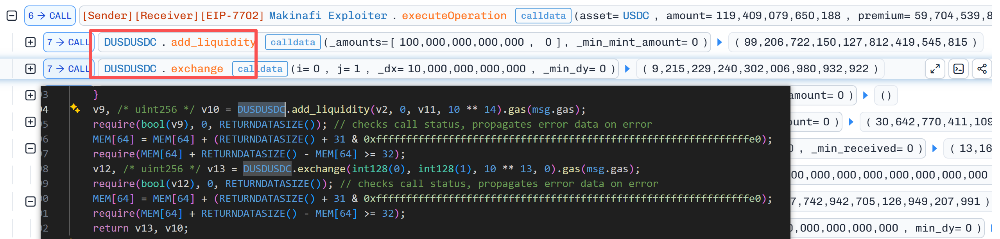

DUSDUSDC 池中，DUSD 是 Makina 专有的池，大约有 512 万 USDC 和 1123万 DUSD，攻击前的汇率大约是1:1，使用 cast 可以查询到。被偷的是其中的 512万 USDC。

```
✦ 在区块 24273360，该池子中的代币数量如下：

* USDC (0xA0b86991c6218b36c1d19D4a2e9Eb0cE3606eB48):
    * 精度: 6
    * 原始余额: 5,127,936,124,721
    * 实际数量: 5,127,936.12 USDC

* DUSD (0x1e33E98aF620F1D563fcD3cfd3C75acE841204ef):
    * 精度: 18
    * 原始余额: 11,239,518,468,075,928,879,476,662
    * 实际数量: 11,239,518.47 DUSD

* 1 USDC 兑换 DUSD:
    * 输出: 989,270,241,027,889,520 (18 decimals)
    * 汇率: 1 USDC ≈ 0.98927 DUSD

* 1 DUSD 兑换 USDC:
    * 输出: 1,010,614 (6 decimals)
    * 汇率: 1 DUSD ≈ 1.01061 USDC
```

### Step2：花1.7亿兑换 `3Crv`，使用 `3Crv` 攻击 `MIM-3LP3CRV-f` 池，拉高 `MIM` 价格

`Curve.fi: DAI/USDC/USDT Pool`（0xbEbc44782C7dB0a1A60Cb6fe97d0b483032FF1C7）池，砸了1.7亿，获得 `3Crv`（0x6c3F90f043a72FA612cbac8115EE7e52BDe6E490） 。

之后使用 `3Crv` 对 `MIM-3LP3CRV-f` （0x5a6A4D54456819380173272A5E8E9B9904BdF41B）池进行 `add_liquidity` 、`remove_liquidity_one_coin`、 `exchange` 调用，拉高 `MIM` 的价格。

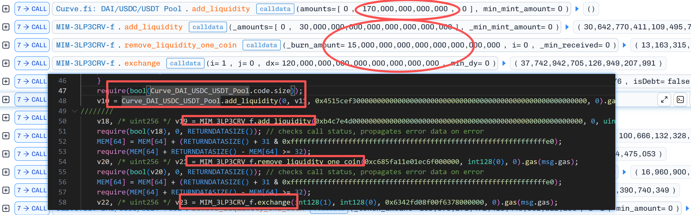

### Step3：调用Makina的 `accountForPosition` 和 `updateTotalAum`，提高 Makina 的 Aum

合约的源码是：https://github.com/MakinaHQ/makina-core.git ，这两个函数的大致功能分别是：

> accountForPosition 函数
> 
> * 定义位置：src/caliber/Caliber.sol
> * 参数：Instruction calldata instruction
>     * instruction 是一个结构体，包含：
>         * positionId: 仓位的唯一标识 ID。
>         * isDebt: 布尔值，标识该仓位是否为负债。
>         * groupId: 分组 ID（用于处理需要多个仓位共同记账的复杂情况）。
>         * instructionType: 指令类型，此处必须为 ACCOUNTING。
>         * affectedTokens: 受该仓位影响的代币列表。
>         * commands 和 state: 传递给 Weiroll 虚拟机的指令和状态，用于执行具体的记账逻辑（如查询第三方协议的余额）。
>         * merkleProof: 证明该记账指令是经过治理授权的 Merkle 证明。
> * 返回值：(uint256 value, int256 change)
>     * value: 仓位更新后的当前价值。
>     * change: 本次更新导致的价值变动量（新价值 - 旧价值）。
> * 函数功能：
>     * 具体仓位评估：用于更新 Caliber 中某个特定策略仓位的账面价值。
>     * 逻辑执行：利用 Weiroll 虚拟机执行链上逻辑，动态获取策略在外部协议中的实际资产价值。
>     * 仓位生命周期管理：
>         * 如果仓位价值变为 0，则该仓位会被关闭。
>         * 如果是新仓位（初次记账），则会创建该仓位并记录初始价值。
>     * 安全验证：通过 Merkle 树验证记账指令的合法性，防止非法篡改资产价值。
>     * 权限控制：仅限获得授权的会计地址执行。
> 
> updateTotalAum 函数
>
> * 定义位置：src/machine/Machine.sol
> * 参数：无（external 调用时不需要参数）。
> * 返回值：uint256 —— 更新后的总资产管理规模（Total AUM）。
> * 函数功能：
>     * 全局价值计算：计算 Machine 在所有链上（包括 Hub Caliber 和所有 Spoke Calibers）的总资产价值。它会将所有闲置代币（Idle Tokens）和策略仓位（Positions）的价值根据预言机（Oracle）价格换算为统一的记账代币（Accounting Token）价值。
>     * 状态更新：更新合约存储中的 _lastTotalAum 和全局记账时间。
>     * 费用管理：通过调用 MachineUtils.manageFees 自动计算并提取管理费（Fixed Fee）和业绩费（Performance Fee），并将其铸造成份额代币。


攻击者攻击 positionId == 329781725403426819283923979544582973776 这个头寸，传入合法的 Weiroll指令集 和 MerkleTree 证明，成功更新它的总值。

> 注：Makina管理16个头寸，被攻击的是其中之一

通过日志，可以明确观测到，正在尝试计算它持有的 LP Token 到底值多少钱，“如果我现在把这些 LP Token 销毁，并全部只取回一种币（通常是取回基础资产，如 3Crv），我能拿回多少？”，因此 Aum 被拉高。

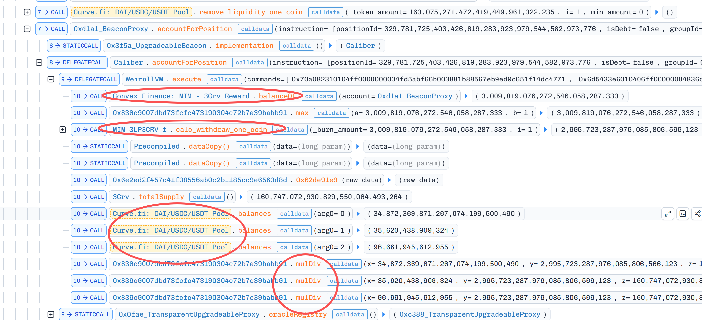


### 思考：为什么任何人都能更新Makina的价值？

A：很可能是数据重放。

<details>
<summary>Gemini：该接口允许被重放。</summary>

✦ src/caliber/Caliber.sol 中的 accountForPosition 函数的权限控制机制比较特殊，可以从以下几个维度来分析：


  1. 调用者权限（Caller Control）
  从代码上看，accountForPosition 没有针对 `msg.sender` 的角色限制。它没有使用 onlyOperator、restricted 或 onlyRiskManager
  等修饰符。这意味着理论上任何外部地址都可以调用此函数。


   1 function accountForPosition(Instruction calldata instruction)
   2     external
   3     override
   4     nonReentrant
   5     returns (uint256, int256)
   6 {
   7     // ...
   8     return _accountForPosition(instruction, true);
   9 }


  2. 指令级权限（Instruction-based Control）
  虽然任何人都可以发起调用，但该函数受限于极严苛的指令验证。它通过内部调用 _checkInstructionIsAllowed(instruction) 来实现权限控制：

   * Merkle 树验证：传入的 Instruction 必须包含一个有效的 Merkle Proof，证明该指令存在于由风险管理员（Risk Manager）配置的
     allowedInstrRoot（允许指令根）中。
   * 指令完整性检查：Merkle 树的叶子节点哈希包含了指令的所有关键字段，包括 commands（执行代码）、state（状态参数）、positionId、affectedTokens 以及 instructionType。这意味着调用者无法随意篡改要执行的内容。
   * 类型限制：在 _accountForPosition 中，如果 checks 为 true，会强制要求指令类型必须是 InstructionType.ACCOUNTING。


  3. 业务逻辑限制
   * 现有仓位检查：该函数开头会检查 $._positionIds.contains(instruction.positionId)。如果仓位不存在，则报错。这意味着该函数只能用于更新已存在的仓位，不能用于开仓。
   * 分组限制：如果仓位属于某个组（groupId != 0），则不能单独调用此函数进行核算（需通过 accountForPositionBatch）。


  总结
  accountForPosition 的权限模型是 “任何人都可以触发，但只能执行预先授权的核算逻辑”：
   1. 没有角色限制：不需要特定的 Operator 或 Manager 权限，这样可以方便任何人（或机器人）随时更新仓位的账面价值，保证数据的及时性（Freshness）。
   2. 严格的内容控制：执行的逻辑（Weiroll 脚本）必须是系统预先许可并存入 Merkle 树的。由于核算指令（Accounting Instruction）通常只涉及读取状态并返回数值，不涉及资产转移，因此这种设计在保证安全的同时提升了灵活性。


  注意：与之相对的 managePosition 函数（涉及实际的资产操作）则有严格的 onlyOperator 权限控制。

</details>


### Step4：DUSD价值依赖Makina总值，DUSD价格升高，将DUSD换成USD，获利345万

观察 `exchange` 的过程，发现它依赖了 `Machine.lastTotalAum`，这个值已经被我们拉高了。

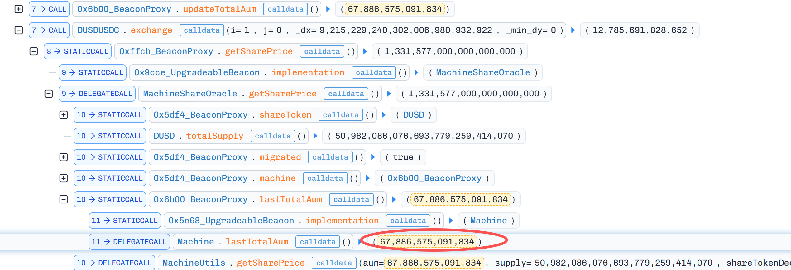

将 Step2 获得的 DUSD `exchange` 为 USDC，获得的 LP `remove_liquidity_one_coin` 为 USDC，获得巨大的利润。

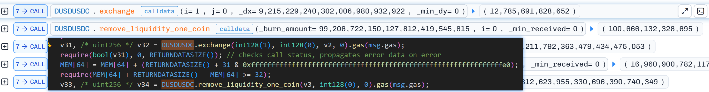

结合 Step2，可以计算得到，获利的数额是： 3,451,824.15 USDC。

<details>
<summary>Gemini：详细计算过程。</summary>

2. 最终收入 (Credit / Revenue)
根据你提供的后续操作返回的数值（假设单位为 USDC，精度 6）：

Exchange 换回 (由 DUSD 换回 USDC)：12,785,691.828652 USDC

(分析：投入 1000 万，换回 1278 万，单这一步就赚了 278 万，说明 DUSD 价格被推高了)

Burn 换回 (移除 LP 换回 USDC)：100,666,132.328695 USDC

(分析：投入 1 亿做 LP，取回 1.0066 亿，LP 价值也增加了)

3. 利润计算 (Net Profit)
总收入 - 总成本 = 净利润

12,785,691.82 + 100,666,132.32 - 110,000,000.00 = 3,451,824.15 USDC

</details>

### Step5：恢复 `MIM-3LP3CRV-f` 汇率，恢复 `Curve.fi: DAI/USDC/USDT Pool` 汇率，恢复 Makina Aum 到原始值

恢复到初始状态，损失部分滑点，池子里共有512万，单次攻击获利345万，需要再次发动攻击。

### Step6：repeat Step2/3/4/5，获利 165万

支出还是 110,000,000.00 ， 收入是 12,847,360.46 USDC 和 98,809,788.73 USDC，因此利润是：**1,657,149.19 USDC**

<details>
<summary>Gemini：详细计算过程。</summary>

这次的利润 (~165 万美元) 比上一次计算的 (~345 万美元) 少了一半以上。

Exchange 部分表现更好：换回了 1284 万（上次是 1278 万），说明价格拉得更高了。

LP 部分亏损了：LP 撤资时只拿回了 9880 万（上次是 1.006 亿）。这意味着为了拉高那个价格，流动性池子遭受了更大的滑点损失（Impermanent Loss 变成了 Permanent Loss），导致你撤资时本金受损。

总体依然暴利：尽管 LP 亏了 120 万本金，但 Exchange 赚的 284 万覆盖了亏损，最终还是净赚 165 万美元。

</details>

### Step7：归还闪电贷，兑换为 ETH，付费给矿工

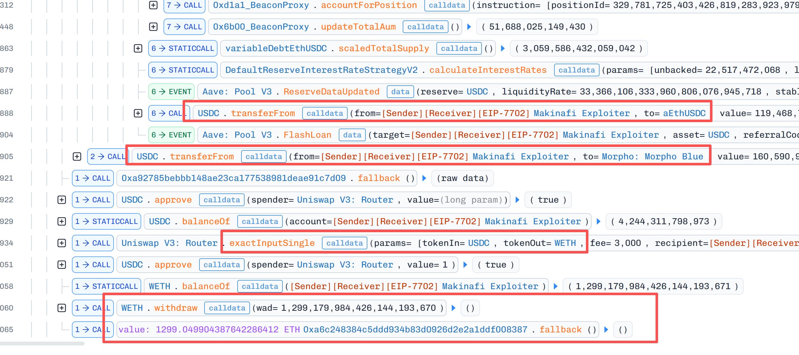

## 漏洞修复

根据上文分析，漏洞在于允许任何人通过重放的方式调用 `accountForPosition`，直接调用 `updateTotalAum` 更新 DUSD 的价值。而 `accountForPosition` 依赖外部的池子，导致预言机被攻击。

### Q：Makina经过多家著名公司的审计，为什么还会有遗漏？

一方面，`accountForPosition` 只允许经过 MerkleTree 验证的请求，具体依赖什么池子完全是维护者控制，一眼看过去该行为风险较低，即便是重放，似乎也无法造成什么影响。而 `updateTotalAum` 是纯数学运算，风险也较低。

另一方面，这两个漏洞组合起来才能实现攻击，缺一不可，能想到这一层，攻击者的水平还是很不错的。

启示：经典的外部可控oracle，即便是有数据合法性验证，也一定要谨慎审计。

### Patch1：两个函数均加入了权限管控，onlyAccountingAuthorized

https://github.com/MakinaHQ/makina-core/commit/618b8f393be8857ec165070b2ecb33087cc02140#diff-0c2f6d9c3b26d9dbe7c73242a0de15cdaa8d6aafec42073122312615a1f4647cR406

```
-  function updateTotalAum() external override nonReentrant notRecoveryMode returns (uint256) {
+  function updateTotalAum() external override nonReentrant onlyAccountingAuthorized returns (uint256) {
```

https://github.com/MakinaHQ/makina-core/commit/618b8f393be8857ec165070b2ecb33087cc02140#diff-9fe379b974008e3ddb482e152e2e2389ee569726ab54a1d45966283a1d222b91R324

```
  function accountForPosition(Instruction calldata instruction)
      external
      override
      nonReentrant
+     onlyAccountingAuthorized
```

### Patch2：updateTotalAum 加入了波动性校验，禁止短时间内剧烈波动

~~本来还想看看有没有把上涨和下跌全部考虑到，代码里有绝对值。~~所以，牌没有问题。

https://github.com/MakinaHQ/makina-core/commit/618b8f393be8857ec165070b2ecb33087cc02140#diff-c428e67562536c7e08733420f5d38c15dcaacc199d835325a3b52720a116db8eR38-R42

```solidity
function _checkMaxRelativeChange(
    uint256 previousValue,
    uint256 newValue,
    uint256 maxPercentDeltaPerSecond,
    uint256 elapsedTime
) internal pure {
    if (previousValue == 0) {
        return;
    }

    uint256 absChange = previousValue > newValue ? previousValue - newValue : newValue - previousValue;
    uint256 relChange = absChange.mulDiv(RATE_SCALE, previousValue);

    if (relChange > maxPercentDeltaPerSecond.saturatingMul(elapsedTime)) {
        revert Errors.MaxAuthorizedPriceChangeExceeded();
    }
}
```

这下无懈可击了，完结撒花~~~~

碎碎念：新人的第一份作品，如有疏漏，请指出，感谢！

## 吐槽：DeFiHackLabs 的 makina_exp.sol 写的什么东西？

这代码和实际的攻击半毛钱关系？？？有点野狗了

https://github.com/SunWeb3Sec/DeFiHackLabs/blob/af499584a25e8e25bb80fef6690eb128dd135b28/src/test/2026-01/makina_exp.sol

```solidity
    function testMakinaExploitTest() public {
        IMachineShareOracle oracle = IMachineShareOracle(SHARE_ORACLE);
        IMachine machine = IMachine(MACHINE);

        uint256 priceBefore = oracle.getSharePrice();
        emit log_named_uint("sharePrice before", priceBefore);

        // Permissionless AUM refresh (root cause). Anyone can call this.
        uint256 updatedAum = machine.updateTotalAum();
        emit log_named_uint("updated AUM", updatedAum);

        uint256 priceAfter = oracle.getSharePrice();
        emit log_named_uint("sharePrice after", priceAfter);

        // Simulate the attacker holding DUSD (flashloaned in the real attack).
        uint256 dusdAmount = 9_215_229 ether; // 9.215M DUSD
        deal(DUSD, address(this), dusdAmount);
        IERC20Minimal(DUSD).approve(DUSD_USDC_POOL, type(uint256).max);

        uint256 usdcBefore = IERC20Minimal(USDC).balanceOf(address(this));
        ICurvePool2Coins(DUSD_USDC_POOL).exchange(1, 0, dusdAmount, 0);
        uint256 usdcAfter = IERC20Minimal(USDC).balanceOf(address(this));

        emit log_named_uint("USDC out for DUSD swap", usdcAfter - usdcBefore);

        // In the real exploit, this swap and subsequent LP withdrawal were executed
        // right after a flashloan-driven AUM inflation, draining USDC from the pool.
    }
```